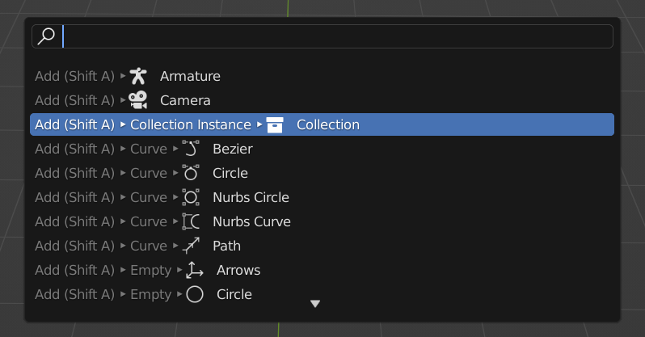
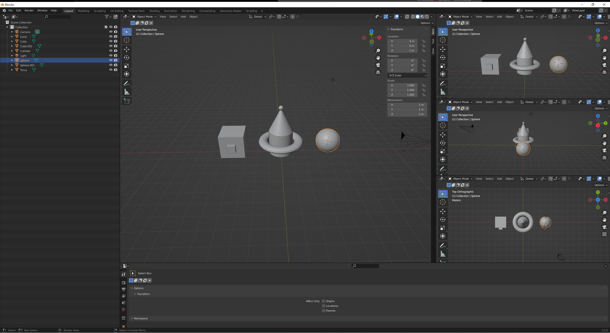
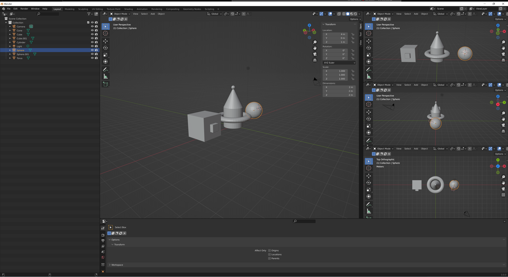

I'm learning blender! Here are some of the things that I've learned:
=====================================================================
* ## Space tells you all the hotkeys (not by default)

* ## Middle click to look around

* ## Control + middle click or scroll to zoom in and out
* ## G to move or G + an axis to move by that axis (same for r (rotate) and s (scale)) (I guess that one was a bit of a bonus) (Whewee, I am using a lot of parentheses)
* ## Select the thing that you want to delete and then X to delete
* ## Shift + middle click
* ## Numpad