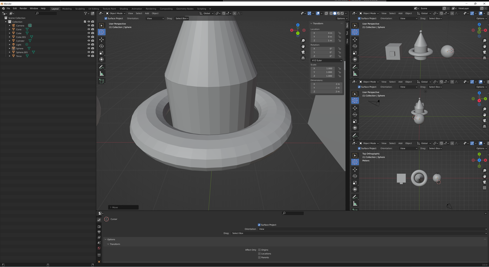

I'm learning blender! Here are some of the things that I've learned:
=====================================================================

> * ## Space tells you all the hotkeys (not by default)
> 

> * ## Middle click to look around
> 
> 

> * ## Control + middle click or scroll to zoom in and out

> ### Normal:
> 

> ### Zoomed in:
> 

> ### Zoomed out:
> 

> * ## Select things with left click

> * ## G to move based on your 2d thing you see or G + an axis to move by that axis (same for r (rotate) and s (scale)) (I guess that one was a bit of a bonus) (Whewee, I am using a lot of parentheses)
> ### G (move):
> #### Normal:
> 
> #### Moved with just G:
> 
> #### G + x (moving by the x axis):
> 
> #### G + y (moving by the y axis):
> 
> #### G + z (moving by the z axis):
> 
> ### R (rotate):
> #### Rotated with just R:
> 
> #### R + x (rotating by the x axis):
> 
> #### R + y (rotating by the y axis):
> 
> #### R + z (rotating by the z axis):
> 

> * ## Select the thing that you want to delete and then X to delete
> * ## Shift + middle click
> * ## Numpad
